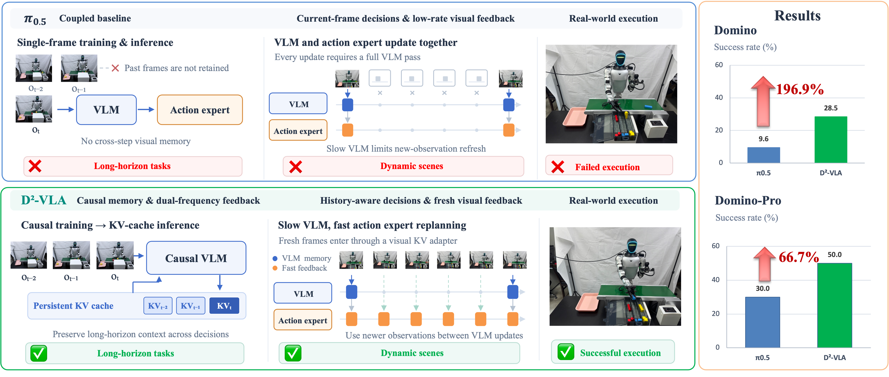
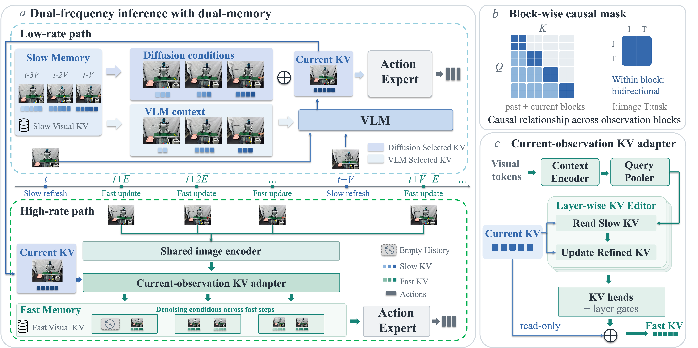
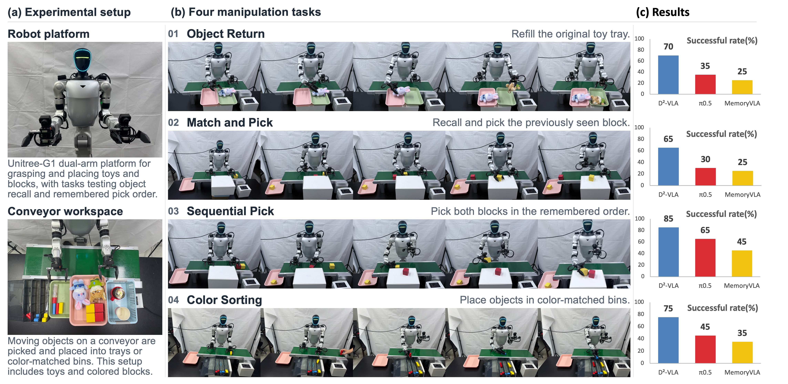

<h1 align="center">
  D<sup>2</sup>-VLA: Dual-Memory Dual-Frequency<br>
  Vision-Language-Action Model for Long Dynamic Manipulation
</h1>

<p align="center">
  <strong>Remember Longer. React Faster.</strong>
</p>

<p align="center">
  Zijian Ye<sup>1,*</sup>, Chengqi Wei<sup>2,*</sup>, Wei Huang<sup>1,†</sup>, Anlin Zheng<sup>1,†</sup>, Chunyu Zou<sup>1</sup>, Liangyu Wu<sup>2</sup>,<br>
  Zikang Zhao<sup>2</sup>, Zhenjie Peng<sup>2</sup>, Yushuo Yang<sup>2</sup>, Shuman Zhao<sup>1</sup>, Zhongrui Wang<sup>2,✉</sup>, Xiaojuan Qi<sup>1,✉</sup>
</p>

<p align="center">
  <sup>1</sup> The University of Hong Kong &nbsp;&nbsp;
  <sup>2</sup> Southern University of Science and Technology<br>
  <sup>*</sup> Equal contribution &nbsp;&nbsp;
  <sup>†</sup> Project lead &nbsp;&nbsp;
  <sup>✉</sup> Corresponding author
</p>


<p align="center">
  <a href="https://arxiv.org/abs/2609.34792"></a>
  <a href="https://zijianyy.github.io/Dual-Memory-Dual-Frequency-VLA-Webpage/"></a>
  <a href="#citation"></a>
</p>

This repository presents **D²-VLA**, a vision-language-action model that combines temporal memory with responsive control for long-horizon dynamic manipulation.


<p align="center">
  
</p>

---

## ✨ Highlights

- **Memory and responsiveness in one framework.** D²-VLA combines causal KV reuse, separate historical reads for the VLM and action expert, and fresh visual updates between VLM passes.
- **Stronger dynamic manipulation.** D²-VLA achieves **29.3%** complete-task success on DOMINO and **60.0%** on DOMINO-Long, improving over π₀.₅ by **19.7** and **24.6 percentage points**, respectively.
- **A benchmark for remembering while acting.** **DOMINO-Long** contains ten tasks that separate early visual cues from later manipulation, including interactions with moving objects.

## 📄 Abstract

Long-horizon manipulation requires robots to remember cues that are no longer in view while responding to moving objects. Yet vision-language-action policies often rely on the latest observation, and refreshing their visual context typically requires another costly vision-language model pass. We present **D²-VLA**, which combines dual memory and dual-frequency control at the KV-cache interface of a pretrained VLA. Block-wise causal KV caching encodes observations incrementally, while separate historical read views provide the VLM and action expert with the context each needs. Between periodic VLM updates, a gated adapter incorporates fresh visual features into the latest history-conditioned KV block, and a short fast-memory queue supports action replanning. We also introduce **DOMINO-Long**, a ten-task benchmark requiring earlier visual cues to guide later manipulation of moving objects. Experiments demonstrate improved complete-task success across dynamic simulation, static long-horizon benchmarks, and eight real-robot tasks.

---

<a id="overview"></a>

## 🔍 Overview

**What should a robot remember, and how often should it refresh its understanding?** D²-VLA addresses both questions at the native KV-cache interface of a pretrained π₀.₅ policy.


<p align="center">
  
</p>


### 1. Causal temporal memory

Block-wise causal attention lets the model reuse historical KV states and encode only the latest observation at each VLM update. This preserves context across observations without repeatedly encoding the full visual history.

### 2. Dual memory

The VLM and action expert exhibit different temporal attention patterns. D²-VLA uses independent online attention statistics to construct **separate historical KV read views** for these two components. Stored KV blocks remain complete; selection applies only to historical reads, while instruction tokens and the current block are preserved.

### 3. Dual-frequency control

The VLM periodically refreshes a history-conditioned KV anchor. Between these refreshes, a lightweight **gated visual adapter** updates the action expert's visual conditioning using fresh image features. A bounded **fast-memory queue** retains recent refined blocks to support action replanning and short-range motion reasoning.


---

<a id="results"></a>

## 📈 Experimental Results

**SR** denotes complete-task success rate: an episode succeeds only when all task requirements are completed. **MS** denotes DOMINO's Manipulation Score. Higher is better for both metrics. All values below are reported in the accompanying manuscript unless explicitly marked as calculated.

### Dynamic manipulation on DOMINO

Policies are trained on clean demonstrations and evaluated on **clean L1** with the Aloha-AgileX embodiment.

| Method | SR (%) ↑ | MS ↑ |
|:---|---:|---:|
| OpenVLA | 1.5 | 6.1 |
| RDT-1B | 5.3 | 17.7 |
| π₀ | 8.2 | 24.0 |
| π₀.₅ | 9.6 | 26.2 |
| InternVLA-M1 | 5.4 | 27.6 |
| VLA-Adapter | 4.4 | 24.3 |
| π₀-FAST | 3.5 | 20.9 |
| OpenVLA-OFT | 9.1 | 24.1 |
| StarVLA-OFT | 10.9 | 30.5 |
| PUMA | 17.2 | 35.0 |
| **D²-VLA (Ours)** | **29.3** | **40.6** |

D²-VLA improves over PUMA by **12.1 percentage points** in complete-task success and **5.6 points** in Manipulation Score.


---

<a id="real-world"></a>

## 🤖 Real-World Experiments

We evaluate D²-VLA on a **Unitree G1D** robot across **four static long-horizon tasks** and **four dynamic long-horizon tasks**. Success requires completing the full manipulation sequence with the correct object identities, ordering, and final configuration when applicable.


<p align="center">
  
</p>


---

<a id="citation"></a>

## 📚 Citation

If you find our work useful, please consider citing our paper:

```bibtex
@misc{ye2026d2vla,
  title = {{D$^2$-VLA}: Dual-Memory Dual-Frequency Vision-Language-Action Model For Long Dynamic Manipulation},
  author = {Zijian Ye and Chengqi Wei and Wei Huang and Anlin Zheng and
            Chunyu Zou and Liangyu Wu and Zikang Zhao and Zhenjie Peng and
            Yushuo Yang and Shuman Zhao and Zhongrui Wang and Xiaojuan Qi},
  year = {2026},
  eprint = {2609.34792},
  archivePrefix = {arXiv},
  primaryClass = {cs.CV},
  doi = {10.48550/arXiv.2609.34792},
  url = {https://arxiv.org/abs/2609.34792}
}
```


## ✉️ Contact

For research inquiries, please contact [Zijian Ye](mailto:yezi0007@connect.hku.hk) or [Chengqi Wei](mailto:12641054@mail.sustech.edu.cn).
